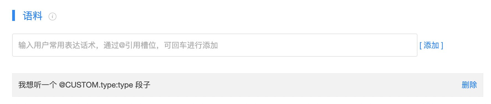

## 如何使用Node.js在Azero智能操作系统上开发技能

​	SoundAI Azero 智能操作系统(下文简称Azero系统)支持在线使用Node.js，编写技能代码、一键部署、模拟测试。

​	本文以段子技能为例，展示具体开发部署流程。


###  创建技能

​	登录[SoundAI Azero 智能操作系统网站](https://developer-fat-azero.soundai.cn/index) -> 技能中心 -> 开始创建 -> 自定义技能(任务型)

​	技能名称写入段子(根据技能，自定义名称)，点击保存，网页将跳转到技能基础信息页，键入技能基本信息，如下图:


​	点击保存，技能及创建成功。


### 配置交互模型

​	交互模型分两大块，分别为意图管理、槽位管理。定义好交互模型有助于Azero系统将用户的语音意图更好的解析，传递给到特定的技能，进行业务逻辑处理。

​	假想段子技能两种交互逻辑，具体如下：

```
交互逻辑1(宽泛的):
	用户：我想听一个段子。
	Azero：您想要听什么类型的段子？
	用户：欢乐的。
	Azero：确认欢乐的吗？
	用户：确认。
	Azero：(段子具体内容)。
	
交互逻辑2(明确的)：
	用户：我想要听一个欢乐的段子。
	Azero：确认欢乐的段子吗？
	用户：确认。
	Azero：(段子具体内容)。
```

​	拆解交互逻辑，用户的意图是想听一个段子。段子类型有欢乐的、搞笑的等等。

​	则Azero系统用意图管理，管理“我想听一个段子”的需求。 槽位管理，定义段子的类型。


#### 槽位管理

​	用于明确意图。以段子技能为例，明确段子类型。

​	点击槽位管理 -> 自定义槽位 键入基本信息。	


​	Azero系统会用Json以Key-Value的形式将槽位信息带给段子技能，Key为type。Value为搞笑的，或者欢乐的。段子技能可根据Key获取到相关Value，返回相关类型的段子。


#### 意图管理

​	用户的哪些语音输入是创建的技能想要处理的。以段子为例，结合上文槽位管理，创建意图。

​	点击意图管理 -> 创建自定义意图。 填写意图相关信息。

​	**语料：** 用户实现该意图的常用表达话术。键入“我想听一个段子”、“我想听一个 @CUSTOM.type:type 段子”。


​	“我想听一个 @CUSTOM.type:type 段子”，在输入“我想听一个”文字之后，输入@，将展示系统槽位与账户定义过的自定义槽位，如下图，段子技能选择自定义槽位 -> 段子类型。

!

​	Azero系统会自动将语料字串补全为“我想听一个 @CUSTOM.type:type”，此时保证语句完整，在字串后增加“段子”，补全语料，点击添加。



​	**槽位：** 以Key-Value的形式，被Azero系统用Json传递给段子技能。只有当语料中有@槽位管理中的自定义槽位，槽位下才会自动生成槽位信息。

​	勾选必填，加入澄清话术。澄清话术是在用户没有明确指明想听那种类型的段子时，进一步引导客户，输入希望听的段子类型。键入“您想听什么类型的段子？”。

​	此时界面显示：	


​	**意图确认：** 当意图状态开启时，对槽位中的槽位信息进行确认。如，相对槽位中的type(即段子类型)做意图确认，则键入“确认&”，页面会弹出想选择的槽位信息，如图：


​	点击自定义槽位 -> type。页面将字串补全为”确认&type“，字串后补全“段子吗？”，意图确认话术处理完毕。

​	至此意图完成，如下图。


​	点击保存，Azero系统将生成技能框架代码，下一步开发部署服务。	


### 服务部署

​	Azero系统支持键入WebService地址部署技能服务，也支持直接在线使用Node.js开发部署技能服务，如需了解以WebService方式部署服务可点击[WebService方式部署服务](https://github.com/sai-azero/skill-sample-java-hello-world)。下文讲解在线使用Node.js开发部署技能服务。

​	点击部署服务，可见Azero系统已经生成了技能服务框架。


​	下面对生成的代码进一步介绍。

```
const PUNCH_LINE_IntentRequestHandler = {
    canHandle(handlerInput) {
        return azero.getIntentConfirm(handlerInput,'PUNCH_LINE');
    },
    handle(handlerInput) {
        let slot = azero.getSlotValue(handlerInput,"SlotName");
        let jsonObject = JSON.parse(slot);
        let slotNames = jsonObject.parameters;//槽位将被放在这个对象中，soltNames.type
        
        //if(slotNames.type ==='欢乐的'){
     		//	speakOutput = '这是一个欢乐的段子Demo';
				//}else{
   			//	speakOutput = '这是一个段子Demo';
				//}
				
        //NLP服务器如果有满足用户意图的响应内容，会存放在answer中，开发者可以自主选择是否使用
        let speakOutput = jsonObject.answer;
        //假设开发者想使用NLP匹配到的内容，那么开发者可以对speakOutput判空，当speakOutput为空时使用开发者自				 //己段子资源。
        if(speakOutput ==null || speakOutput.length<1){
        //将自有的段子内容替换掉"欢迎使用技能"字符串
        	speakOutput = '欢迎使用技能';
        }
        //此处技能服务将处理完的结果生成模板返回给终端(模板配置可以参考Azero SDK for Node.js开发文档)，终端				//根据返回内容进行展示与语音播报
        return handlerInput.responseBuilder
        	//显示的模板
        	.addRenderTemplateDirective({
        		type: `BodyTemplate1`,
        		title: speakOutput,
        		textContent: {
        			"primaryText": {
        			"text": speakOutput,
        			"type": "string"
        			}
        		}
        	})
        	//语音播报内容
        	.speak(speakOutput)
        	.withShouldEndSession(true)
        	.getResponse();
    }
};
```

​	PUNCH_LINE_IntentRequestHandler：技能服务如果匹配到意图(意图管理中配置的意图PUNCH_LINE),则在canHandle中返回true，会进到函数handle中进行技能逻辑处理。

```
const IntentRequestHandler = {
    canHandle(handlerInput) {
        return azero.getIntentRequest(handlerInput);
    },
    handle(handlerInput) {
    	let slot = azero.getSlotValue(handlerInput,"SlotName");
        let jsonObject = JSON.parse(slot);
        let speakOutput = jsonObject.answer;
        if(speakOutput ==null || speakOutput.length<1){
            speakOutput = '欢迎使用技能';
        }
        return handlerInput.responseBuilder
            .addRenderTemplateDirective({
                type: `BodyTemplate1`,
                title: speakOutput,
                textContent: {
                    "primaryText": {
                        "text": speakOutput,
                        "type": "string"
                    }
                }
            })
            .speak(speakOutput)
            .withShouldEndSession(true)
            .getResponse();
    }
};

```

​	IntentRequestHandler：公共意图的处理函数，若意图request没有匹配到对应的意图Handler则执行该函数逻辑。即Azero将用户的语音意图已经给到本技能服务，但是在PUNCH_LINE_IntentRequestHandler中canhandle返回false时，执行该函数，对于用户请求做兜底处理。

​	将上面两个Handler注册到Azero服务中，即完成技能开发，点击保存代码，即完成服务部署。

```
exports.handler = azero_sdk.SkillBuilders.custom()
    .addRequestHandlers(
        PUNCH_LINE_IntentRequestHandler,
        IntentRequestHandler
    ).lambda();
```

​	如需了解更多如何使用Node.js开发技能，请参考：

​	[Azero SDK for Node.js开发文档](https://github.com/sai-azero/azero-skills-kit-sdk-for-nodejs)。

​	[ASK SDK for Node.js](http://ask-sdk-node-typedoc.s3-website-us-east-1.amazonaws.com/)


###  模拟测试

​	输入文字以模拟用户语音输入，以段子技能为例。

​	服务器部署中修改代码如下：

``` 
	const IntentRequestHandler = {
    canHandle(handlerInput) {
        return azero.getIntentRequest(handlerInput);
    },
    handle(handlerInput) {
    	let slot = azero.getSlotValue(handlerInput,"SlotName");
        let jsonObject = JSON.parse(slot);
        let slotNames = jsonObject.parameters;
        //修改部分----start
        //let speakOutput = jsonObject.answer;
        //if(speakOutput ==null || speakOutput.length<1){
        if(slotNames.type ==='欢乐的'){
     			speakOutput = '这是一个欢乐的段子Demo';
				}else{
   				speakOutput = '这是一个段子Demo';
				}
        //}
        //修改部分----end
        return handlerInput.responseBuilder
            .addRenderTemplateDirective({
                type: `BodyTemplate1`,
                title: speakOutput,
                textContent: {
                    "primaryText": {
                        "text": speakOutput,
                        "type": "string"
                    }
                }
            })
            .speak(speakOutput)
            .withShouldEndSession(true)
            .getResponse();
    }
};
```


##### 有屏设备模拟测试

​	模拟测试界面，选择有屏设备。根据交互逻辑输入“我想听一个段子”，“搞笑的”、“确认”。


​	终端将收到界面模板，及语音播报内容。


##### 无屏设备模拟测试

​	模拟测试界面，选择无屏设备，根据交互逻辑输入“我想听一个欢乐的段子”、“确认”。

	

​	终端将收到语音播报内容。

​	到这一步，使用Node.js在服务器上开发流程已经完成。	


### 技能发布

​	点击技能发布 -> 发布上线 键入发布信息，点击申请上线，即会看到如下界面。


​	当审核过后，即可为终端设备配置该技能，使用该技能。

​	至此使用Node.js开发技能，部署服务的流程已经完全完成。


### 为设备配置技能

​	设备中心 -> 已创建设备 -> +创建设备


​	根据您的设备，选择设备类型，此处选择 **音箱** ， **Android操作系统** ，键入SoundAi，点击保存。

​	跳转到设备信息页面键入设备的具体信息。


​	页面将跳转到技能配置，Azero系统会为设备配置部门官方技能，如果您需要其他的技能也可以点击添加。

​	选择 **我的技能** ，即可看到您已经发布成功的技能，选择 **添加技能** ，则您为您的设备添加自定义技能完毕。

​	至此技能部署，及设备添加技能已经全部完成。


### 设备上如何处理技能返回

请参考：

​	[Android设备](https://github.com/sai-azero/Azero_Sample_for_Android)

​	[Linux设备](https://github.com/sai-azero/Azero_Sample_for_Linux)


### 服务器部署处源代码

​	详见当前目录下，code.txt。

​	使用时，只需要复制PUNCH_LINE_IntentRequestHandler下，handle(handlerInput) {}函数中的代码到您服务部署下的 **技能名_IntentRequestHandler** 下的handle(handlerInput) {}函数中即可。
